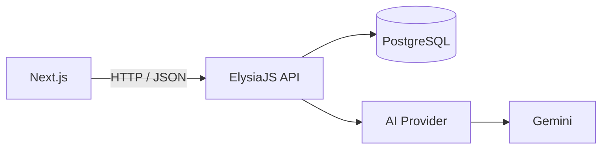

# AI Usage & Engineering Decisions — ClinicOS

This document explains how AI tools were used during the architecture,
design, implementation, debugging, and validation of ClinicOS.

---

## AI Tools Used

### Claude Code

Primary development agent used for:

- Frontend implementation
- API implementation
- Refactoring
- Test generation 

### ChatGPT

Used for:

- Prompt design
- UX review

### Fable 5

Used for:

- Rapid UI prototyping
-  frontend iteration

### Higgsfield MCP

Used during the visual design/prototyping process by claude

---

## Useful Prompts

### 1. Database Architecture

> "Design a normalized PostgreSQL schema with Prisma 7 for an outpatient
> EMR. It must track Doctors, Patients, Appointments, and Consultations.
> The Consultation model must support complete auditability of AI
> assistance: store raw doctor notes, initial AI draft JSON, final
> clinician-saved note JSON, boolean flags for wasAiUsed and wasAiEdited,
> and an clientRequestId to prevent duplicate submits."

### 2. AI Structured-Output Design

> "Write a strict system prompt and schema for Gemini 2.5 Flash that
> converts unstructured doctor shorthand into a structured clinical JSON
> object containing chief complaint, symptoms, relevant history,
> medications, doctor plan, and missing information. Do not infer
> diagnoses, vitals, dosages, or other information that is not present
> in the source notes. Include validation and a repair mechanism for
> malformed model output."

### 3. Frontend UX

> "Design a focused consultation workspace in Next.js and Tailwind CSS:
> patient context, raw doctor notes, and structured AI review. Visually
> distinguish AI-generated fields from doctor-edited fields. Provide
> unsaved-change protection and persist active drafts locally."

---

## Where AI Was Wrong

 AI was infering missing fields like symptoms etc that where not present in the original notes.

### How I identified the problem

I tested the extraction behavior using deliberately incomplete and
ambiguous consultation notes and compared the generated structured
output against the original source text.

### How I fixed it

I changed the AI prompt to make the model a factual extractor.

The model is instructed to:

- Extract only information explicitly present in the notes
- Never infer diagnoses
- Never invent vitals
- Never invent medication dosages
- Never fill missing clinical information with assumptions

Instead, missing information is represented through the
`missingInformation` field.

AI output is also schema-validated before it reaches the application.

Most importantly, AI output remains a draft. The doctor reviews and edits it before the final consultation is saved.

---

## Important Engineering Decision

### AI suggested

A monolithic Next.js implementation using Server Actions/API routes
to access Prisma and the LLM directly.

### Why I rejected it

The assessment explicitly required a separate ElysiaJS backend.

Keeping the backend separate also provides a clearer API boundary,
isolates business logic from the frontend, and makes the AI provider
easier to replace or mock during testing.

## What I Implemented

ClinicOS uses a decoupled frontend/backend architecture:

